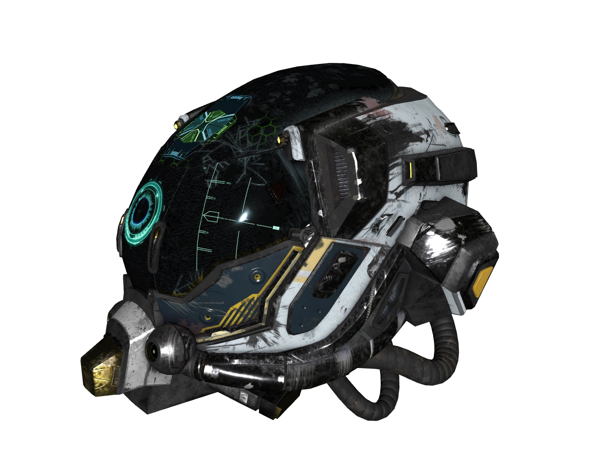

# 🎥 Graphics Kernel ( Render Engine )

Basically this is a rendering library/kernel. The main purpose was render [AssetKit](https://github.com/recp/assetkit) content. Then it became general purpose rendering library. You can also call this "Graphics Kit".

libgk doesn't depend on AssetKit, so there are another library to load AssetKit content to libgk called [assetkit-gl](https://github.com/recp/assetkit-gl), you can see how to load contents to libgk in this library. Because libgk doesn't provide loading contents, in the future maybe it will.

Currently this library only renders using OpenGL, but in the future other apis like `Vulkan`, `DirectX`, `Metal` are considered to be supported! 

# Features:
- Similar scene data structure with COLLADA/glTF 
- Shader generator for common materials (phong, blinn, lambert, const) 
   - This generator also supports textures, shadowmaps ... all feeatures to render scene perfectly and fast
- Shader manager (currently for common profile)
- Transform caching
- Uniform location caching
- Built-in trackball
- Multi-pass rendering 
- Rendering to Texture
- Multiple Render Targets
- Textures
- State Manager / Caching
- Frustum Culling
- Configurable shadowmaps: Yes you can select which technique to use! More techniques may be supportted by time
   - Basic/Simple Shadow Maps
   - Cascaded Shadow Maps (PSSM)
- Order Independent Transparency
   - Weighted, Blended OIT
   - Some other techniques aill also be supported natively
- PBR materials
   - Metallic-Roughness Workflow
   - Specular-Glossiness Workflow
- Simple animations
- Skeletal animations
- ... 
- and some built-in helpers for many common tasks and more by fetures time...

# Todo
- [ ] Real-Time Path Tracing
- [ ] Order objects before rendering
- [x] PBR
- [x] Transparency
- [ ] Occlusion Culling
- [ ] Level of Detail for mesh
- [ ] Multithread rendering
- [ ] Instanced Rendering
- [ ] Animations
  - [x] Autoreserve animations
  - [x] Play count...
  - [x] Simple Animations
  - [ ] Keyframe animations
    - [x] Animate float/vec3/vec4
    - [ ] Interpolations
       - [x] STEP
       - [x] LINEAR
       - [x] CUBIC BEZIER SPLINE
       - [ ] CUBIC HERMITE SPLINE
       - [ ] B-SPLINE
       - [ ] CARDINAL SPLINE
  - [x] Skeletal animations (working on this)
  - [ ] Morph animations
- [ ] ... 
 
# Screenshots

# Build 
todo

# License
MIT. check the LICENSE file

# Notes
- This library is still unshaped, wait this until AssetKit finished. 
- After finished this AssetKit and library, I'll publish documentation and update README.
- Also check [simple-collada-viewer](https://github.com/recp/simple-collada-viewer) repo to see an example to how to use this
